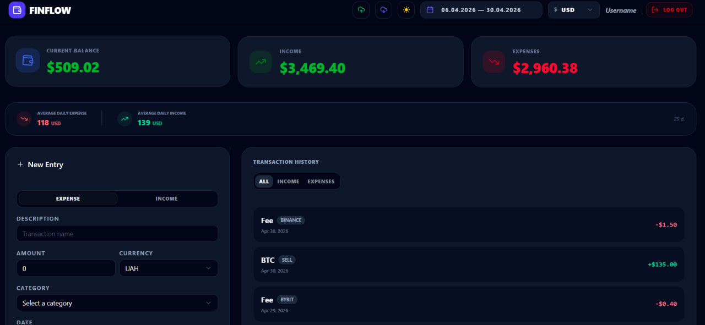
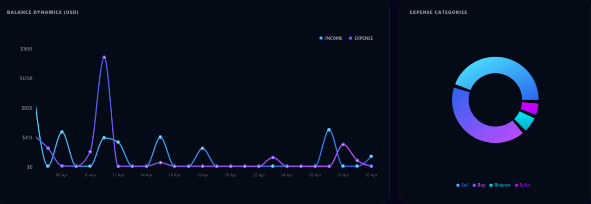
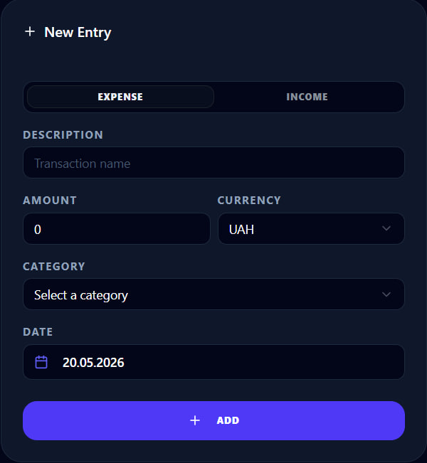
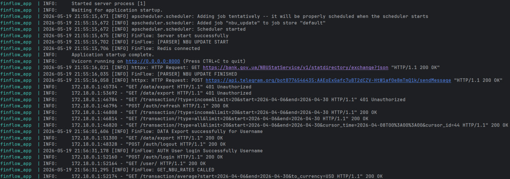

# FinFlow — Full-Stack Personal Finance Manager

FinFlow is a robust, high-performance personal finance management system designed for modern personal accounting. It allows users to track incomes and expenses, manage flexible categories, and analyze financial health with real-time multi-currency conversion and smart data processing.

> **Active Development**: This project is currently in active development. New features are being added, and architectural improvements are made regularly to ensure industry-standard reliability.

## Awards & Recognition

FinFlow secured **1st Place** at a regional college web development and programming competition (May 2026) and has received official accreditation from the **Ministry of Education and Science of Ukraine**. The project was highly evaluated by the expert jury for its complex asynchronous backend architecture, Redis caching integration, and fault-tolerant external API parsing. 

*Note: To maintain the developer's privacy and anonymity in the open-source community, real names (FIO) are not published publicly. For official verification, accreditation details, or further inquiries regarding the competition, please contact the repository owner via Direct Messages.*

## Key Features

- **Secure Authentication**: JWT-based system with Access & Refresh token rotation, Argon2 password hashing, and built-in rate limiting (SlowAPI).
- **Real-time Multi-currency**: Automatic exchange rate synchronization (via NBU API) with Redis caching. View your balance in **USD, EUR, UAH, PLN (Zloty), RUB, or CZK**.
- **Financial Analytics**:
    - Summary dashboards for Balance, Income, and Expenses.
    - Average daily spending and income calculation for specific periods.
    - Real-time balance conversion based on live market rates.
- **Advanced Transaction Management**:
    - **Cursor-based Pagination**: Optimized infinite scrolling for smooth browsing of large transaction histories.
    - **Dynamic Filtering**: Comprehensive data filtering by date range, category, or type.
    - **Smart Date Parsing**: Intelligent input processor (English/Russian support).
- **Data Portability**: Full support for Importing and Exporting financial history via JSON files (with strict backend payload size validation).
- **Modern UI/UX**: Clean, responsive dashboard with native Dark Mode support.

## UI & Application Flow

### Main Dashboard
A comprehensive overview of your current balance, incomes, and expenses, automatically converted into your preferred currency using live NBU rates.


### Analytics & Visualizations
Dynamic charts and diagrams breaking down expense categories and balance dynamics over time.


### Transaction Management
Intuitive modals for quick entry creation with category and currency selection.


### Transparent Backend Logging
The backend features a strict, time-zone-aware logging system capturing everything from JWT rotation and payload validation to asynchronous Redis caching and Telegram Bot notifications.


## Tech Stack

### Backend


### Frontend


## Project Structure

```text
├── app/                        # FastAPI Application (Endpoints & Main)
├── core/                       # Security, JWT, Dependencies, and Exceptions
├── database/                   # SQLAlchemy Models and Engine setup
├── frontend/                   # React/TypeScript source code
├── limiter/                    # Rate limiting configuration
├── migrations/                 # Database migration history (Alembic)
├── schemes/                    # Pydantic models for data validation
├── services/                   # Data access and business logic
├── telegram/                   # Admin panel & Logs (Telegram Bot integration)
├── tests/                      # Integration and Mock test suites
├── .dockerignore               # Docker ignore rules
├── .env                        # Environment variables (Local)
├── .gitattributes              # Git attributes config
├── .gitignore                  # Git ignore rules
├── alembic.ini                 # Alembic configuration
├── config.py                   # Global application configuration
├── docker-compose.test.yml     # Orchestration for testing environment
├── docker-compose.yml          # Production/Dev orchestration config
├── Dockerfile                  # Docker image build instructions
├── pytest.ini                  # Pytest configuration
├── README.md                   # Project documentation
├── requirements.txt            # Backend dependencies
└── script.py                   # External API integration (Currency parsing)
```

## Testing

The system is covered by a comprehensive test suite to ensure reliability and security. 
```bash
pytest
```

## Security & Performance

* **Brute-force protection**: Strict rate limiting implemented on sensitive endpoints.
* **Data Integrity**: Powered by **Pydantic v2**, ensuring strict validation at the schema level.
* **Asynchronous Architecture**: Fully non-blocking I/O operations for high concurrency.
* **Secure Data Storage**: Professional standards using HttpOnly, Secure, and SameSite cookie attributes.

---
*Note: Local deployment instructions and environment configurations are restricted for security reasons. For access or inquiries, please contact the repository owner.*